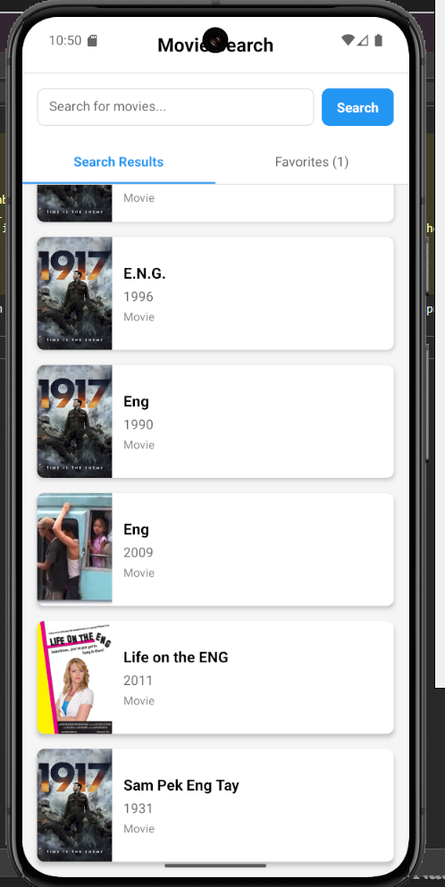
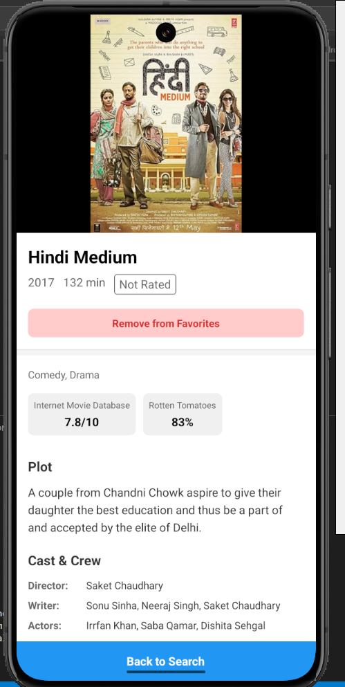
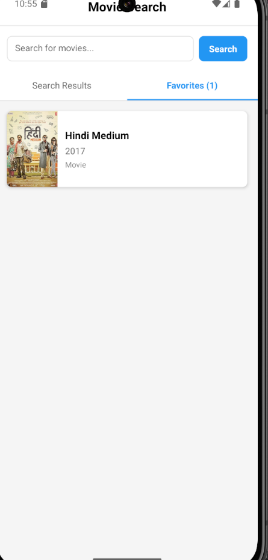

# 🎬 MovieSearchApp

A clean and simple React Native app that allows users to search for movies using the OMDb API, view detailed information, and save favorites. Built with the React Native CLI.

---

## 🚀 Features

- 🔍 **Search movies** by title (live query)
- 🖼 **Display list** of matching movies with title and poster
- 📄 **Tap a movie** to view full details (year, genre, plot, rating)
- ⭐ **Mark/unmark movies** as favorites using AsyncStorage
- 🔁 **Infinite scroll** to load more results as the user scrolls
- 📦 **.env support** for secure API key storage

---

## 📦 Tech Stack

- **React Native CLI**
- **OMDb API** – [https://www.omdbapi.com/](https://www.omdbapi.com/)
- **AsyncStorage** for storing favorite movies locally
- **React Navigation** for screen transitions
- **dotenv** for API key management

---

## 🛠️ Getting Started

### 1. 🔧 Prerequisites

Make sure you have the following installed:

- Node.js ≥ 16.x
- npm or yarn
- Android Studio / Xcode (for emulator or physical device testing)
- React Native CLI

### 2. 📁 Clone the Repository

Clone the repository to your local machine:

```bash
git clone https://github.com/YOUR_USERNAME/movie-search-app.git
cd movie-search-app
```

### 3. 🧩 Install Dependencies

Run the following command to install dependencies:

```bash
npm install
# or
yarn install
```

### 4. 🔧 Set Up Environment Variables

Get a free OMDb API key from [OMDb API](https://www.omdbapi.com/apikey.aspx).

Create a `.env` file in the root folder of your project and add your API key:

```sh
OMDB_API_KEY=your_api_key_here
```

### 5. 🖥️ Running the App

#### Step 1: Start Metro

First, you will need to run **Metro**, the JavaScript build tool for React Native. To start the Metro dev server, run the following command:

```bash
# Using npm
npm start
# OR using Yarn
yarn start
```

#### Step 2: Build and Run Your App

With Metro running, open a new terminal window/pane from the root of your React Native project and use one of the following commands to build and run your Android or iOS app:

##### Android

```bash
# Using npm
npm run android
# OR using Yarn
yarn android
```

##### iOS

For iOS, remember to install CocoaPods dependencies (this only needs to be run on the first clone or after updating native dependencies).

Run the Ruby bundler to install CocoaPods:

```bash
bundle install
```

Then, run this command every time you update your native dependencies:

```bash
bundle exec pod install
```

For more information, visit the [CocoaPods Getting Started guide](https://guides.cocoapods.org/using/getting-started.html).

```bash
# Using npm
npm run ios
# OR using Yarn
yarn ios
```

---

## 🔑 Set Up Environment Variables

Make sure you have the **react-native-dotenv** plugin configured in your `babel.config.js` to use the `.env` file:

```js
module.exports = {
  presets: ['module:@react-native/babel-preset'],
  plugins: [
    [
      'module:react-native-dotenv',
      {
        moduleName: '@env',
        path: '.env',
      },
    ],
  ],
};
```

---

## 📸 Screenshots

### Home Screen


### Movie Details Screen


### Favorite Movies Screen


**How to add these screenshots:**

1. Create an assets folder in your project root:
   ```bash
   mkdir assets
   ```

2. Capture screenshots from your app:
   - On Android: Use Android Studio or device's screenshot feature
   - On iOS: Use Xcode simulator or physical device's screenshot buttons

3. Add the screenshots to your repository:
   ```bash
   git add assets/
   git commit -m "Add app screenshots"
   git push origin main
   ```

4. Update the README.md with the screenshot links as shown above

---

## Common Issues

### App not running?

Reset the Metro bundler cache with:

```bash
npx react-native start --reset-cache
```

---

## 💡 Notes

- Built with **React Native CLI**.
- AsyncStorage is used for saving favorite movies locally.
- The app supports **infinite scrolling** to load more results as the user scrolls.
- Ensure you have correctly configured your API key in the `.env` file.
- If you face issues with **CocoaPods** on iOS, ensure all dependencies are installed and updated.

---

Feel free to reach out if you have any questions or encounter issues!
